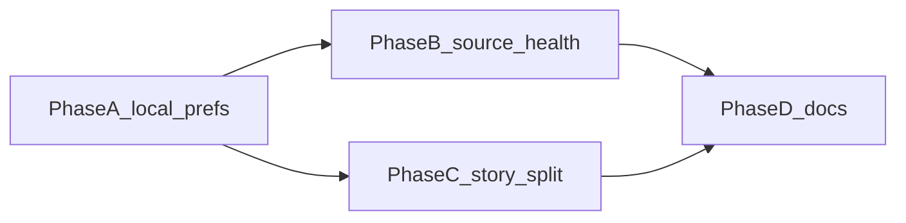

# Pulse — Build Plan

> **What this is:** A Chrome new-tab feed of engineering posts. Duplicate coverage collapses into one master story card. Original titles stay intact.
>
> **How to use this doc:** Phases are independently executable. Do not skip them. v1 is the Chrome extension + thin Next.js API + curated RSS ingest.

## v1 scope

- Chrome MV3 extension that overrides the new tab
- Onboarding: pick 5+ tags from the catalog
- Personalized feed of master-story cards (original titles, author + source, “N sources” expander)
- Reading list and up/down votes in `chrome.storage.local`
- Instant paint from cache; revalidate in the background
- Curated RSS (~40 sources) polled on a Vercel cron (daily on Hobby; every 15 minutes on Pro)
- Source icons from each origin’s favicon / apple-touch-icon, refreshed daily
- Simple clustering: canonical URL, or title Jaccard ≥ 0.72 with ≥ 2 overlapping tokens in a 48-hour window

**Out of scope for v1:** Squads, DevCards, Clickbait Shield / title rewriting, LLM summaries, pgvector, Rust ingest, GraphQL, Plus paywall, ads, Recruiter, email digest, Firefox/Edge, Chrome Web Store, Better Auth.

## Stack (locked)

| Layer | Choice |
|---|---|
| Monorepo | pnpm + Turborepo |
| Web / API | Next.js 16 App Router, API routes, Vercel |
| Database | Supabase Postgres, Prisma 7 TS client |
| Extension | WXT + React + Tailwind v4 |
| Shared | Pure TypeScript (`@pulse/shared`) |
| Auth | None in v1 (anonymous + chrome.storage) |
| Rate limit | Upstash Redis; cron bearer secret |
| Lint / format | oxlint + oxfmt |
| Tests | Vitest (shared), Playwright (web) |

## Architecture

New tab (cached SPA) → `GET /api/feed?tags=` → ranked `Story` rows with nested original-title posts.

Cron `GET /api/cron/ingest` (bearer) polls RSS, upserts posts on `canonicalUrl`, clusters into stories. Cron `GET /api/cron/icons` (bearer, daily) refreshes `Source.iconUrl` from each site’s own icons.

## Product rules

- Never rewrite titles. Representative headline = original title of the highest-authority (then newest) post in the cluster.
- One card per event. Cluster members keep their own titles in the expander.
- No yellow shield, no paywalled cleanup.
- Independent blogs with RSS are first-class sources.

## Feed ranking

```
score = recencyDecay(publishedAt)   # 36h half-life
      * tagMatch(storyTags, userTags)  # Jaccard; zero overlap still scores 0.15
      * sourceAuthority
      * (1 + log1p(upvotes))
      * downvoteDamp                 # 1 in v1; downvotes toggle and do not hide
```

Pass `now` in. Do not call `Date.now()` inside the scorer.

## Unpacked Chrome load (manual)

Browser tools cannot drive `chrome://extensions`. After `pnpm --filter @pulse/extension build` (or `dev`):

1. Open `chrome://extensions`
2. Enable Developer mode
3. Load unpacked → `apps/extension/dist/chrome-mv3`
4. Open a new tab
5. Complete onboarding (5+ tags)
6. Confirm: cached feed paints, then live data (or fixture if API is down)
7. Confirm: original titles, cluster expander, bookmark → Reading list, like/dislike toggle (click again to clear)

## Verification

- `pnpm typecheck && pnpm lint && pnpm format:check && pnpm test`
- Playwright: landing page, `/api/tags`, `/api/feed`, cron without bearer → 401
- Duplicate URL or near-identical titles within 48h → one story
- Titles in API JSON equal the ingested originals

---

## v1.5 — habit + feed quality (personal)

Personal daily driver. **Not** a Chrome Web Store / distribution push. Landing stays unpack-load instructions. No Better Auth, no anonymous `deviceId`, no per-user server-side RSS.

**In:** local mute / follow / seen / hide; operator source health; operator story split for bad clusters.  
**Out:** CWS listing, marketing install funnel, paste-arbitrary-RSS with server ownership, Squads / embeddings / title rewriting.

New catalog sources stay a seed edit (`packages/db/scripts/sources.ts` + `pnpm db:seed`), not a product feature.

### Locked product rules

- Prefs stay in `chrome.storage.local` via [`LocalState`](apps/extension/lib/storage.ts). Bump `FEED_CACHE_VERSION` when the visibility pipeline changes.
- Downvotes still do **not** hide cards. Hide / mute / seen are explicit actions.
- Titles stay original. Split does not rewrite titles.
- Follow is a local boost/filter over the curated catalog — not a separate ingest tenant.

### Phase A — Local feed quality loop

Extend `localStateSchema` in [`apps/extension/lib/storage.ts`](apps/extension/lib/storage.ts):

| Field | Shape | Behavior |
|---|---|---|
| `mutedSourceIds` | `string[]` | Exclude stories whose representative **or** any cluster post is from a muted source |
| `followedSourceIds` | `string[]` | Empty = all catalog sources eligible. Non-empty = prefer followed (boost in client rank; optional soft-filter toggle later) |
| `seenStoryIds` | `{ storyId, seenAt }[]` | Cap ~500, FIFO drop oldest. Mark when opening reader / story |
| `hiddenStoryIds` | existing stub | Wire for display filter + “Hide story” action (today only cleared on vote) |

Visibility pipeline in [`apps/extension/components/app.tsx`](apps/extension/components/app.tsx) (after fetch, before render):

```
stories
  → not in hiddenStoryIds
  → not matching mutedSourceIds
  → optional “hide seen” toggle (default on for Latest, off for Reading list)
  → existing search + StoryFilters
```

**UI**

- [`story-card.tsx`](apps/extension/components/story-card.tsx): Mute source, Hide story; opening card marks seen.
- [`sidebar.tsx`](apps/extension/components/sidebar.tsx) or settings sheet: manage muted / followed lists; “Show seen” toggle.
- Wire `GET /api/sources` in the extension ([`lib/api.ts`](apps/extension/lib/api.ts) already patterns for tags) into a “Your sources” picker (follow), parallel to tag onboarding — catalog only.
- Persist date/source include filters if cheap; otherwise leave session-only and rely on mute/follow for durable prefs.

**Tests:** Zod defaults + filter helpers in `storage.test.ts` / `filters.test.ts`.

### Phase B — Operator source health

Health fields already exist on `Source` (`lastFetchedAt`, `lastError`, `active`). [`packages/db/scripts/source-health.ts`](packages/db/scripts/source-health.ts) already prints JSON — wire it up.

1. Add root/`@pulse/db` script: `pnpm db:source-health` → runs the existing script under `op run`.
2. `GET /api/cron/source-health` (bearer `requireCronSecret`) returning the same payload for remote checks without SSH/DB.
3. Optionally extend `GET /api/sources` with `lastFetchedAt` / `lastError` **only when** `Authorization: Bearer $CRON_SECRET` — keep the public catalog lean for the extension.
4. No user-facing admin UI in v1.5; CLI + bearer JSON is enough for a personal deploy.

### Phase C — Operator “not the same story” split

Clustering is one-way at ingest today ([`apps/web/lib/ingest.ts`](apps/web/lib/ingest.ts)). Bad merges need a reverse path.

1. `POST /api/cron/stories/split` with `requireCronSecret`, Zod body:
   - `storyId`
   - `postIds` — posts to peel into a **new** story (must belong to the story; leave ≥1 post on the original)
2. Transaction: create new `Story` + `StoryPost` rows, remove those posts from the old story, recompute `representativePostId` / `sourceCount` / `publishedAt` for both via existing `refreshStory`.
3. No extension UI in v1.5 — call with curl/`op run` when a bad cluster shows up. Document the curl in this plan’s verification section when implemented.
4. Do **not** add public unmerge; avoid abuse and keep surface small.

### Phase D — Docs / verification only

- Update [`AGENTS.md`](AGENTS.md) out-of-scope / where-to-look for mute, seen, health, split.
- Unpacked checklist adds: mute source, hide story, open→seen, follow sources, `db:source-health`, split curl.
- Still no CWS zip, store assets, or install-marketing rewrite of [`apps/web/app/page.tsx`](apps/web/app/page.tsx).

### Suggested order



Ship A first (daily habit). B and C are operator tools and can land in either order. D last.

### Explicit non-goals (still)

- Chrome Web Store / Firefox / Edge
- Better Auth / sync across machines
- User-submitted RSS URLs with server ingest
- Embeddings / pgvector clustering
- Public comments moderation overhaul (already shipped; leave as-is)
