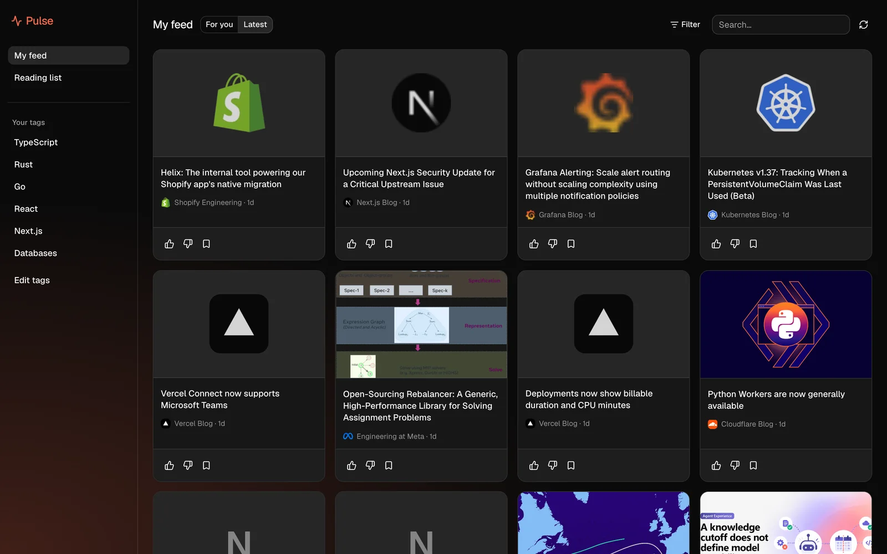
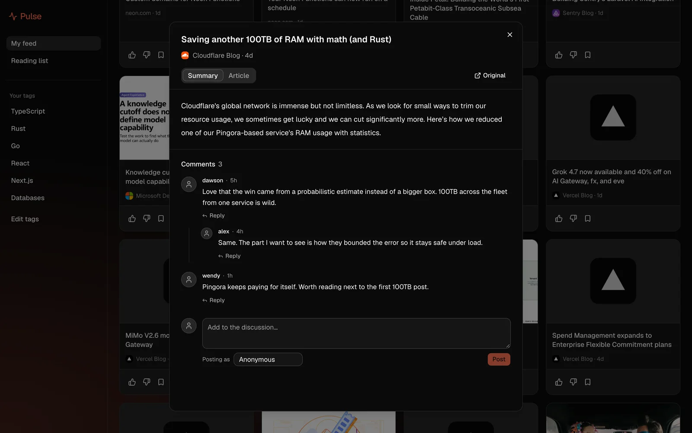
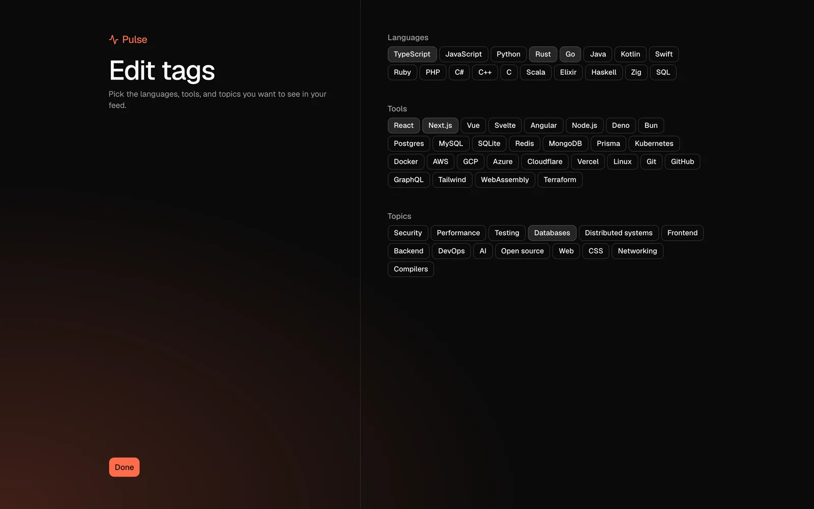

# Pulse

A Chrome extension that swaps your new tab for a developer news feed. Think daily.dev but much cleaner.

Live at [pulse-kappa-green.vercel.app](https://pulse-kappa-green.vercel.app).



## Features

- Stories from around 40 RSS feeds, including a lot of independent blogs
- When several sites cover the same thing, you get one card for it
- Headlines are shown the way the author wrote them
- Follow languages, tools and topics to tune what shows up first
- Open a story to read a summary or the full article, and leave a comment
- Votes and your reading list are saved in `chrome.storage`, so you don't need an account

## Screenshots

| Story summary with a comment thread | Picking your tags |
| :-: | :-: |
|  |  |

## How it works

A cron job fetches the feeds once a day and groups stories about the same thing, matching on the URL and on title similarity within 48 hours. The feed API then sorts stories by how recent they are, whether they match your tags, and how trusted the source is. The extension only asks for the `storage` permission and access to the API.

## Stack

Next.js 16, React 19, TypeScript, Prisma 7, Supabase Postgres, Upstash Redis, WXT, Chrome Manifest V3, Tailwind v4, shadcn/ui, Turborepo. Hosted on Vercel.

## Running locally

You'll need Node 22, pnpm and a Postgres database. The env vars are listed in `.env.example`. I keep mine in 1Password and load them with `op run`:

```sh
pnpm install
op run --account my.1password.com --env-file=.env.op -- pnpm db:migrate
op run --account my.1password.com --env-file=.env.op -- pnpm db:seed
op run --account my.1password.com --env-file=.env.op -- pnpm --filter @pulse/web dev
```

Then build the extension:

```sh
pnpm --filter @pulse/extension build
```

Go to `chrome://extensions`, turn on Developer mode, click Load unpacked and pick `apps/extension/dist/chrome-mv3`. The build points at the production API by default. Set `WXT_API_URL` if you want it to use your local server.

Other scripts: `pnpm test`, `pnpm lint`, `pnpm format`, `pnpm typecheck`.

## Structure

- `apps/web/`: landing page, feed API and the ingest cron
- `apps/extension/`: the new-tab extension
- `packages/shared/`: ranking, clustering and the tag list
- `packages/db/`: Prisma schema and client
- `packages/ui/`: shared components
